# Reporte de Tareas del Assignment 2

## Tarea 1 

### JaCoCo 

Corrimos JaCoCo sobre el proyecto, obteniendo un total de cobertura del 81%, con la clase `Cell` en un 100% de cobertura de líneas.

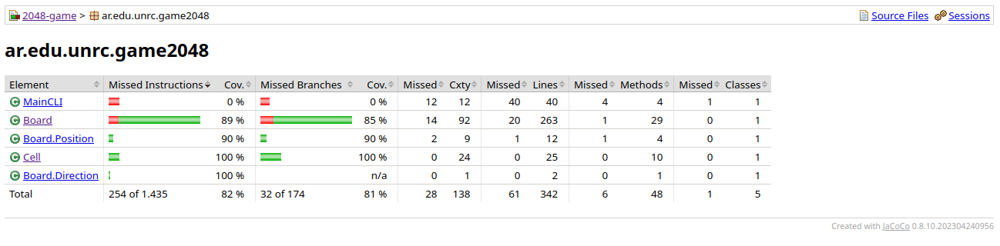
*Figura 1: Cobertura general inicial de líneas e instrucciones obtenida con JaCoCo en la Tarea 1.*

En el caso de la clase `Board`, nos encontramos con varios caminos que no tuvimos en cuenta (principalmente el testeo del método `toString()` y bifurcaciones de movimientos de celdas).

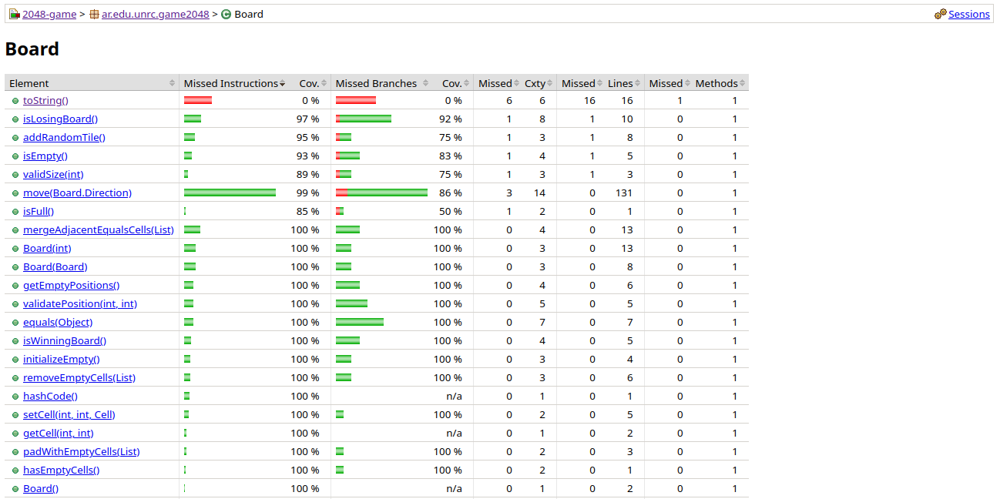
*Figura 2: Cobertura detallada de líneas y ramas en la clase `Board` durante la Tarea 1.*

### PITest 

En el caso de la cobertura de mutantes, obtuvimos de base un 69%, con un 82% de **Test Strength**.

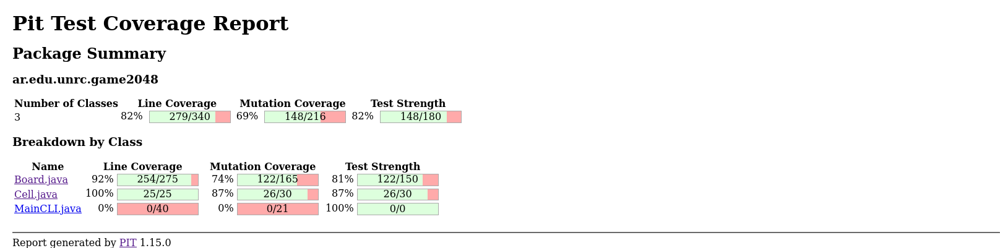
*Figura 3: Reporte de mutantes inicial generado por PITest en la Tarea 1.*

---

## Tarea 2 

Luego de añadir diversos casos de prueba manuales orientados a caminos no explorados, logramos cubrir una mayor cantidad de líneas de código y eliminar mutantes resistentes.

### JaCoCo 

La cobertura de líneas en general del proyecto llegó casi al 100% luego de los casos de prueba añadidos.  

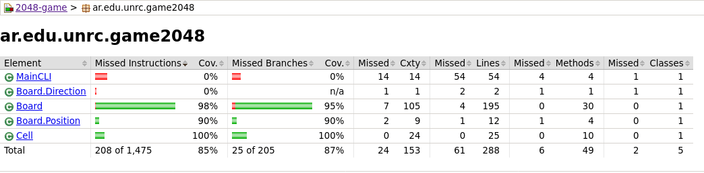
*Figura 4: Cobertura de código consolidada del proyecto tras la incorporación de nuevos casos de prueba en la Tarea 2.*

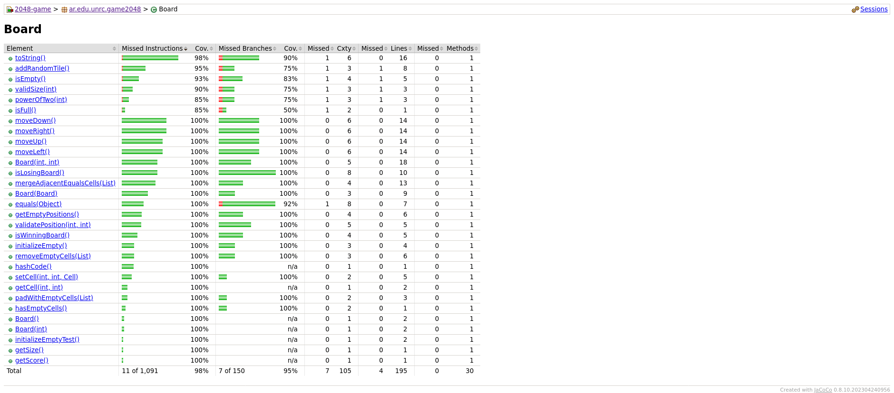
*Figura 5: Cobertura de métodos y ramas de la clase `Board` tras ampliar la suite de pruebas en la Tarea 2.*

### PITest 

La mayor parte de los mutantes de la clase `Board` fueron eliminados. No se llegó a alcanzar el 90% de **Mutation Coverage** global debido a la falta de testeo sobre `MainCLI` (interfaz de línea de comandos dependiente de entrada/salida estándar).

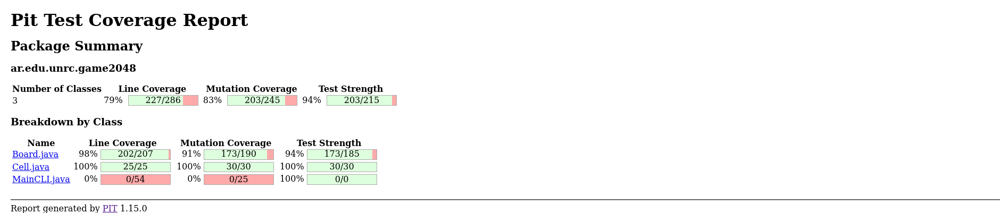
*Figura 6: Cobertura de mutaciones y tasa de eliminación (Mutation Score) alcanzada en la Tarea 2.*

---

## Tarea 3 

En esta etapa no se encontraron bugs funcionales críticos en la lógica central, pero sí lograron detectarse métodos *flaky* (intermitentes), causados principalmente por el no-determinismo en la generación aleatoria de celdas. Los registros de esta etapa fueron realizados tras aplicar mejoras de diseño y aislar componentes.

### Cambios de diseño 

Las siguientes modificaciones fueron aplicadas al proyecto:
- Se encapsuló el método `isPowerOfTwo` en una clase de utilidad propia y se lo convirtió en un método estático puro.
- Se introdujo una abstracción mediante el patrón **Strategy** para desacoplar el generador de números pseudoaleatorios:
  - `RNG`: Implementación productiva que maneja el componente pseudo-aleatorio en la inserción de celdas.
  - `MockRNG`: Implementación determinista utilizada en las suites de prueba para asegurar reproducibilidad y evitar pruebas *flaky*.

### Generación automática con Randoop y `omit-methods.regex`

Para automatizar la exploración de casos de prueba con Randoop se configuró el script `genRandoopTests.sh`, el cual compila el proyecto y ejecuta el generador de secuencias de tests unitarios:

1. **Funcionamiento de `genRandoopTests.sh`**:
   - Define el classpath incluyendo las clases compiladas del juego y el jar ejecutable de Randoop (`randoop-all`).
   - Invoca el generador `randoop.main.GenTests` indicando las clases a testear (`ar.edu.unrc.game2048.Board`, `ar.edu.unrc.game2048.Cell`, `ar.edu.unrc.game2048.MockRNG`), estableciendo un límite temporal (`--time-limit`) y restringiendo la longitud de las secuencias generadas.
   - Centraliza los tests generados en un paquete específico (`randoopTests`) estructurados en clases particionadas (`RegressionTest0.java`, `RegressionTest1.java`, etc.) junto a una suite general (`RegressionTest.java`).`

2. **Rol del archivo `omit-methods.regex`**:
   - Randoop intenta invocar de forma aleatoria cualquier método público accesible por introspección. Sin filtros, Randoop invoca métodos de entrada/salida de consola (como los presentes en `MainCLI`) o llamadas dependientes de aleatoriedad no controlada.
   - El archivo `omit-methods.regex` provee una lista de expresiones regulares que le indica a Randoop qué firmas de métodos debe excluir explícitamente (`--omit-methods=omit-methods.regex`). De esta manera se evita la generación de tests no-deterministas.

### Randoop (Anterior a `repOK`)

En un primer momento, la generación aleatoria pura sin contratos de invariantes arrojó los siguientes resultados:

#### JaCoCo 

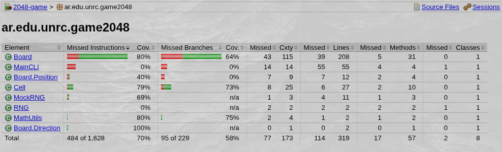
*Figura 7: Cobertura global generada por la suite de Randoop sin método repOK.*

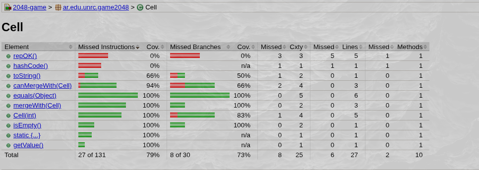
*Figura 8: Cobertura alcanzada por Randoop en la clase `Cell` (pre-repOK).*

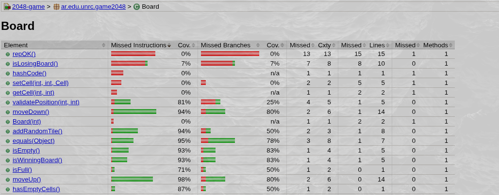
*Figura 9: Cobertura alcanzada por Randoop en la clase `Board` (pre-repOK).*

#### PITest 

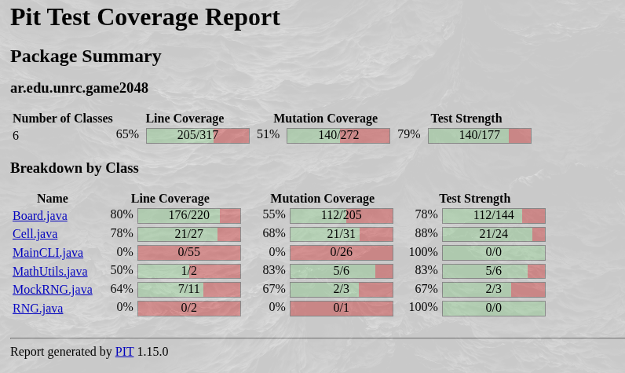
*Figura 10: Análisis de mutantes bajo la suite de Randoop sin validación de invariantes.*

---

### Randoop (Posterior a `repOK`)

Luego de la adición del método `repOK()` (oráculo de invariante de representación) y la integración de `MockRNG` en la configuración de Randoop, los tests generados evalúan secuencias más profundas y válidas sobre el estado interno:

#### JaCoCo

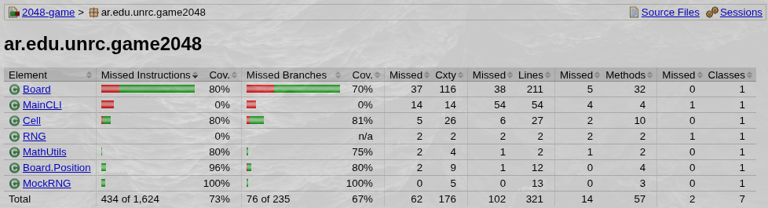
*Figura 11: Cobertura general de código de Randoop incorporando repOK y control de aleatoriedad.*

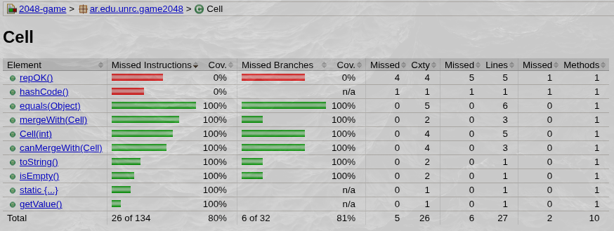
*Figura 12: Cobertura de líneas y ramas en `Cell` bajo la suite Randoop con repOK.*

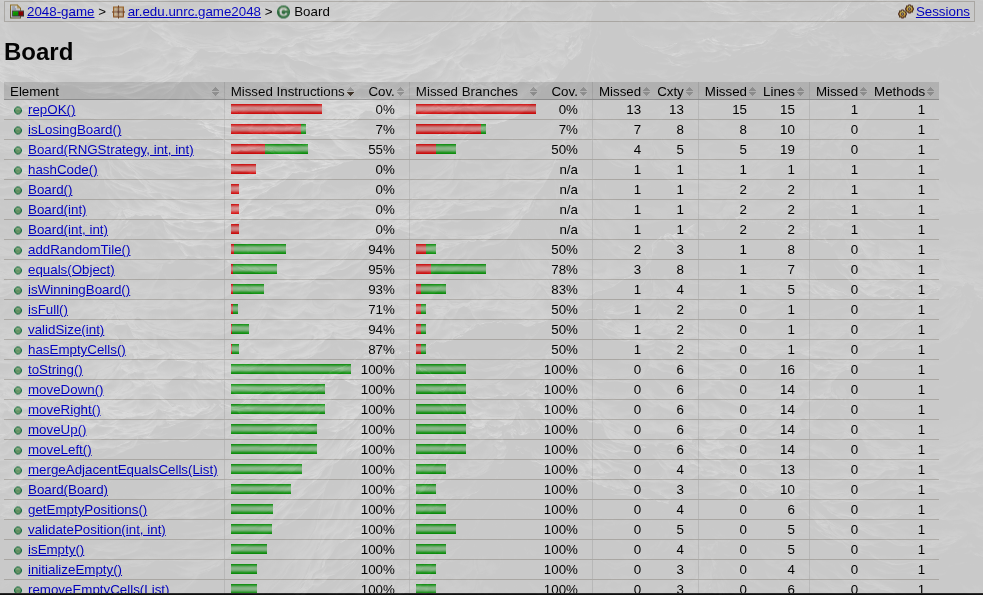
*Figura 13: Cobertura de líneas y ramas en `Board` bajo la suite Randoop con repOK.*

#### PITest

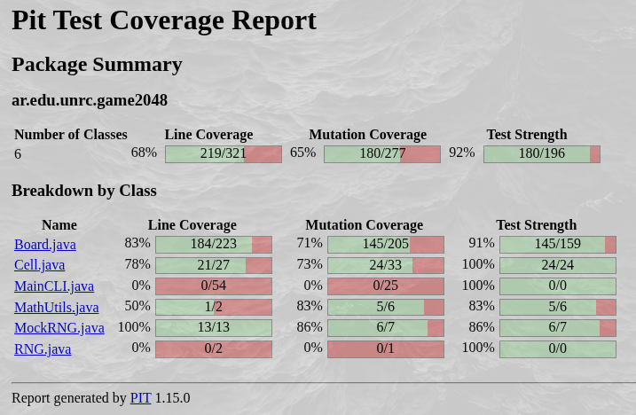
*Figura 14: Cobertura de mutantes y detección de fallas con Randoop tras incorporar repOK.*

---

## Registro Final Consolidado del Proyecto

Esta sección reúne las métricas definitivas obtenidas al finalizar el proyecto, combinando las suites de prueba unitarias manuales y las suites generadas para la verificación exhaustiva del sistema.

### JaCoCo

El análisis general confirma mejores niveles de cobertura tanto en líneas como en ramas condicionales para todas las clases del proyecto:

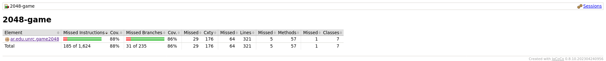
*Figura 15: Resumen de cobertura global del proyecto al cierre del desarrollo.*

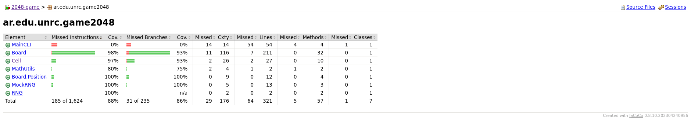
*Figura 16: Detalle comparativo de cobertura de instrucciones y ramas desglosado por clase.*

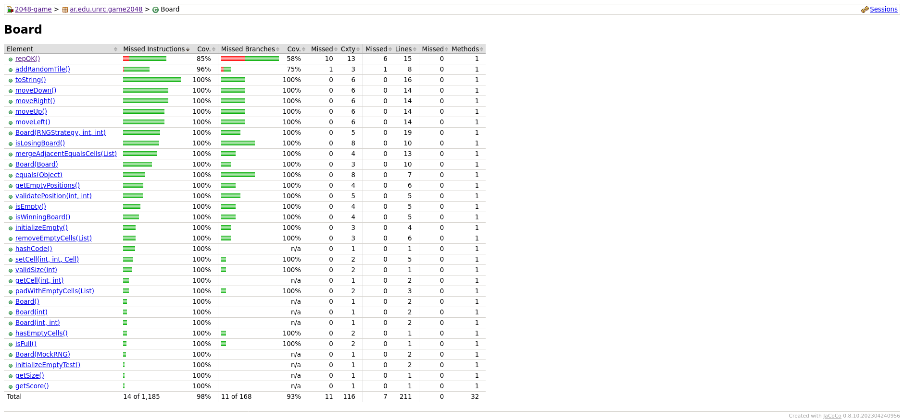
*Figura 17: Cobertura final detallada para la clase `Board`, alcanzando la totalidad de los caminos de ejecución críticos.*

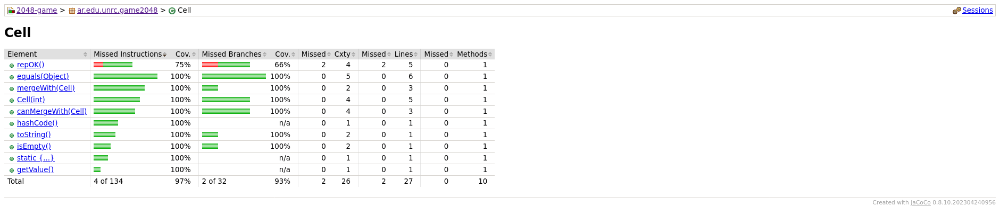
*Figura 18: Cobertura final detallada para la clase `Cell`.*

### PITest

El reporte final de PITest evidencia una alta efectividad en la detección y eliminación de mutantes:

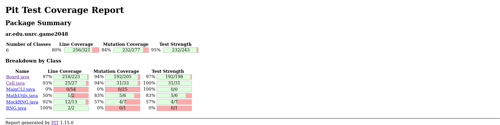
*Figura 19: Resultado final del análisis de mutantes (PITest), consolidando la calidad y resistencia de las pruebas.*